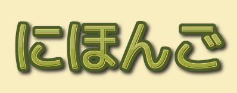

📝 Self-Learning [Chinese Blog](https://alaskasquirrel.github.io/) 

<table>
  <tr>
  <th><a href="https://github.com/alaskasquirrel/Japanese-Nihongo">日本語 Nihongo</a></th>
  </tr>
  <tr>
  <td></td>
  </tr>
</table>

