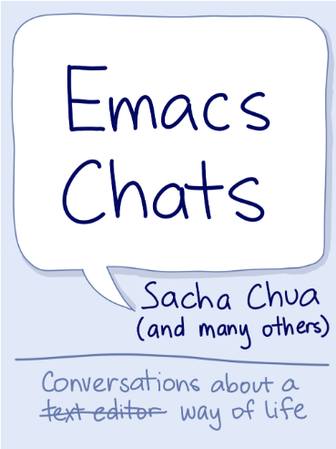
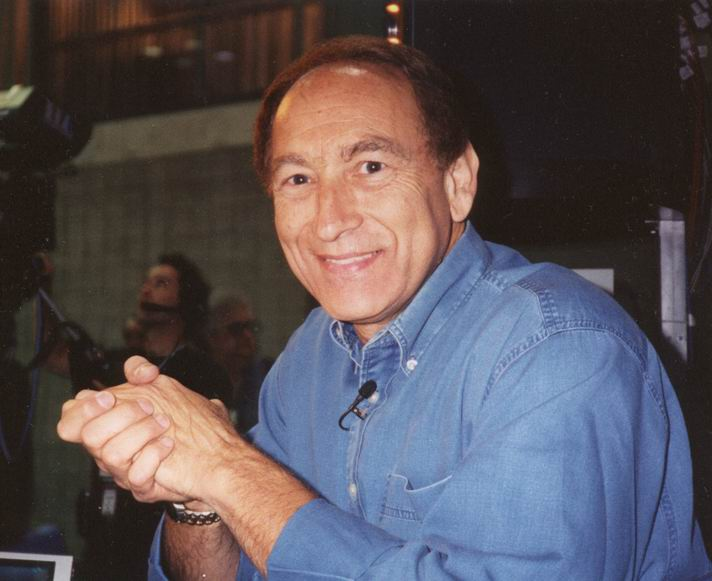

<table>
  <tr>
  <th><a href="https://github.com/alaskasquirrel/mathematical-logic"> 数理逻辑 </a></th>
  <th><a href="https://github.com/alaskasquirrel/Lisp-China"> Lisp China </a></th>
  <th><a href="https://github.com/alaskasquirrel/KurtGodel"> Kurt Gödel </a></th>
  <th><a href="https://alaskasquirrel.github.io/post/Privacy/"> 👁‍🗨 Privacy 👁‍🗨 </a></th>
  <th><a href="https://alaskasquirrel.github.io/post/History/"> 時光機 </a></th>
  <th><a href="https://github.com/alaskasquirrel/Chinese-Podcasts"> 播客 </a></th>
  <tr>
  <td></td>
  <td></td>
  <td></td>
  <td></td>
  <td></td>
  <td></td>  
  </tr>
</table>

******

Thanks:
  * Common Lisp is nice: see <u>**[Lisp Journey](https://lisp-journey.gitlab.io/)**</u> editor  vindarel **<u>[The Common Lisp Cookbook](https://lispcookbook.github.io/cl-cookbook/)</u>** |||||||  <u>**[History of LISP](http://www.softwarepreservation.org/projects/LISP)**</u> editor  Paul McJones

  *  <u>**[Emacs News ](https://sachachua.com/blog/)**</u>   Sacha Chua |||||||   <u>**[Using Emacs Series](https://cestlaz.github.io/stories/emacs/)**</u>  Mike Zamansky  
  
  * <u>**[Programming Language Theory](https://steshaw.org/plt/)**</u> editor   Steven Shaw |||||||  Oleg Kiselyov editor <u>**[FTP](http://okmij.org/ftp/)**</u> 

  *  <u>**[Computer Pioneers](https://history.computer.org/pioneers/)**</u> by J. A. N. Lee ||||||| 🥠<u>**[The Computer Chronicles](http://www.cheifet.com/)**</u> host  Stewart Cheifet

  *  <u>**[Turing Centenial Celebration](https://conifer.rhizome.org/mudd/turing/20180328150956/https://www.princeton.edu/turing//index.xml)**</u>  at Princeton, 10–12 May 2012.
